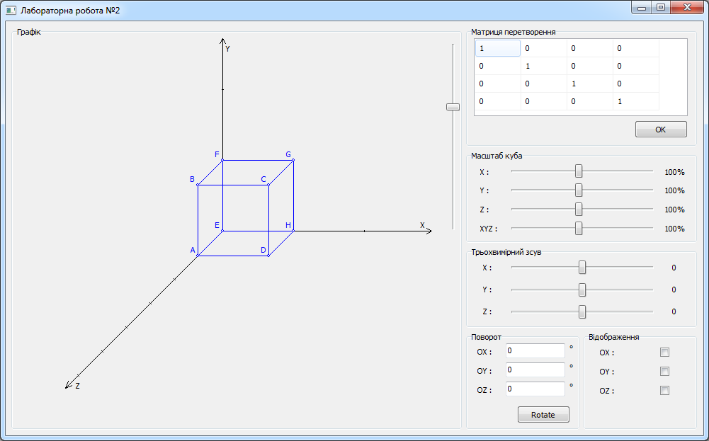
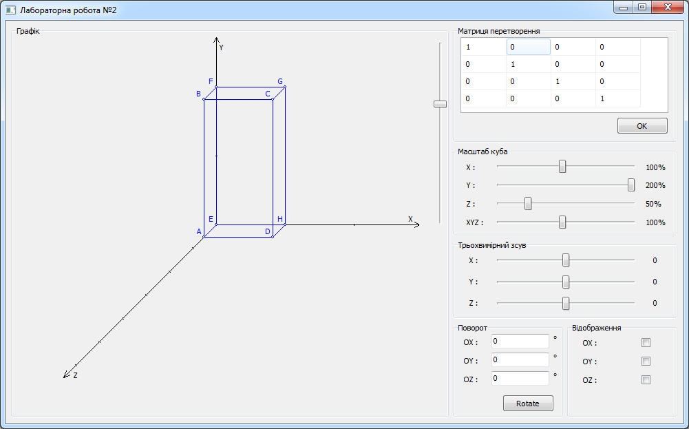
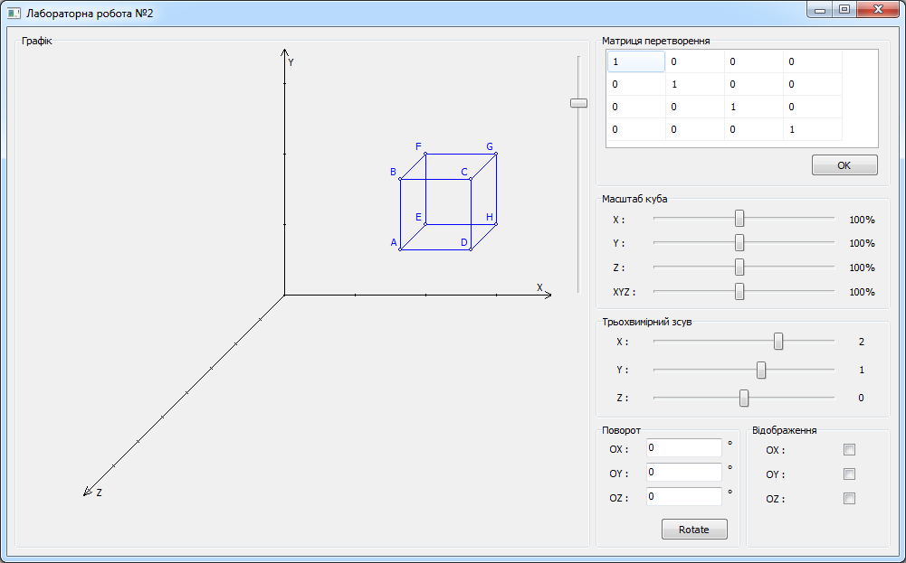
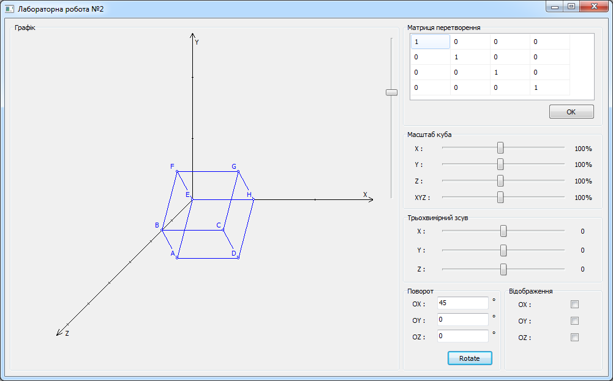
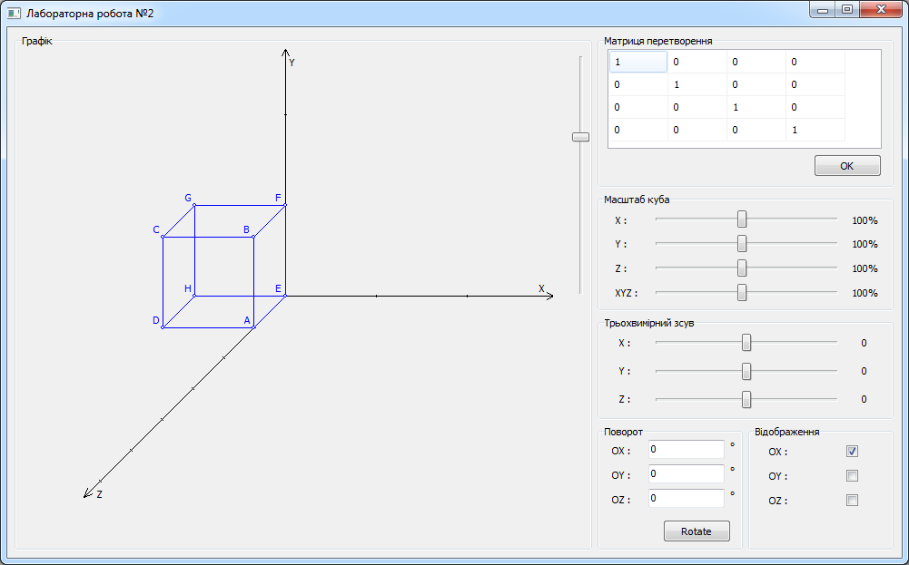

# Spatial coordinate system

Fig. 1. Cube. Basic view

Fig. 2. Scaling along the Y and Z axes

Fig. 3. Move along the X and Y axes

Fig. 4. Rotate around to the X axis

Fig. 5. Reflection relative to the X axis
