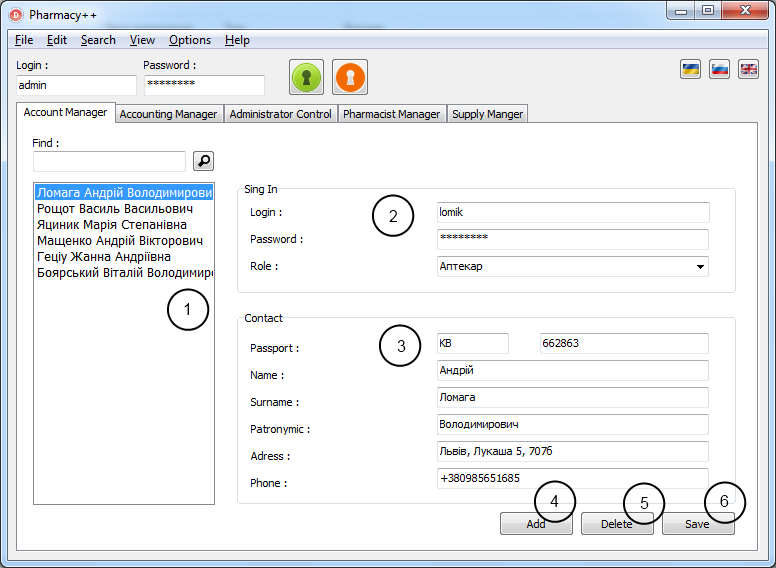
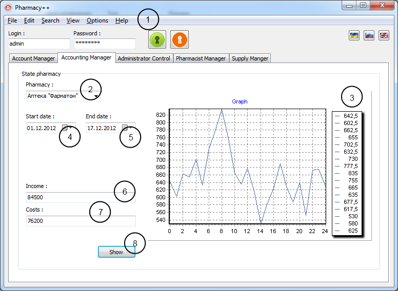
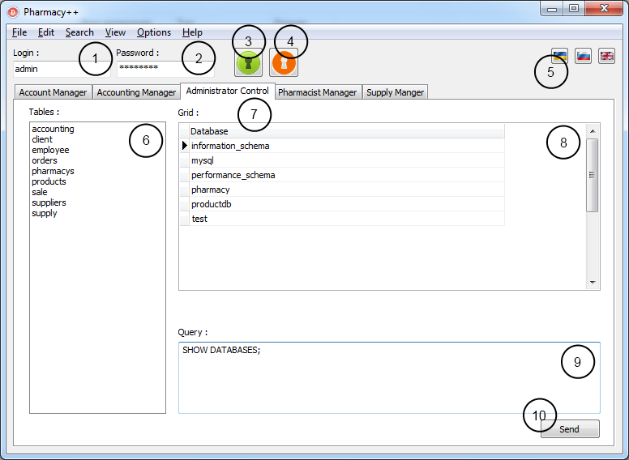
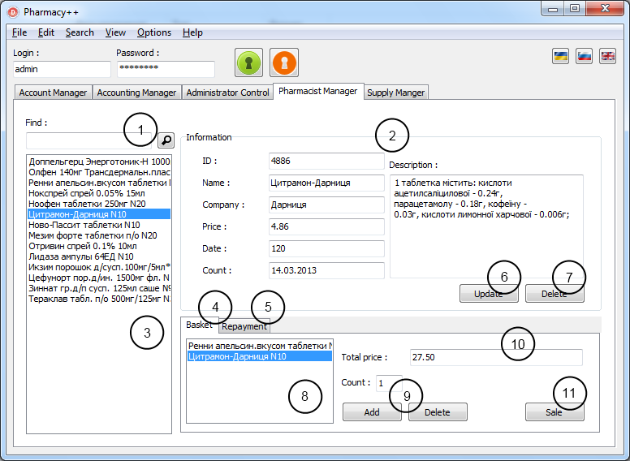
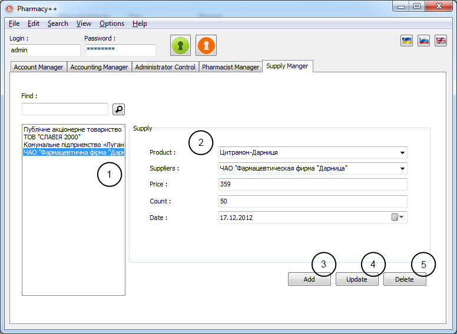

# Pharmacy ERP system

Fig. 1. Account Manager page

1. user list;
2. login/role management;
3. contact information;
4. create new contact;
5. delete existing contact;
6. update contact;

Fig. 2. Accounting Manager

1. main menu;
2. choice pharmacy;
3. economic statistics;
4. start day for stats;
5. end day for stats;
6. income;
7. costs;
8. submit selected period;

Fig. 3. Administrator Control

1. login field;
2. password filed;
3. sign in button;
4. sign out button;
5. language buttons;
6. database tables;
7. admin interface;
8. query result tab;
9. query field;
10. submit query button;

Fig. 4. Pharmacist Manager

1. search for drugs;
2. drug information;
3. list drugs;
4. tab for sale;
5. tab for returns;
6. button for update information;
7. button for delete drag;
8. list drags in bucket;
9. add/delete drag to/from bucket;
10. price;
11. submit sale;

Fig. 5. Supply Manager

1. list orders;
2. supply information;
3. add new one;
4. update information;   
5. delete selected;
